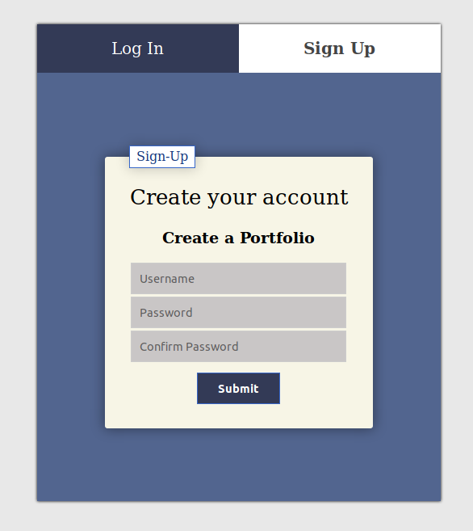
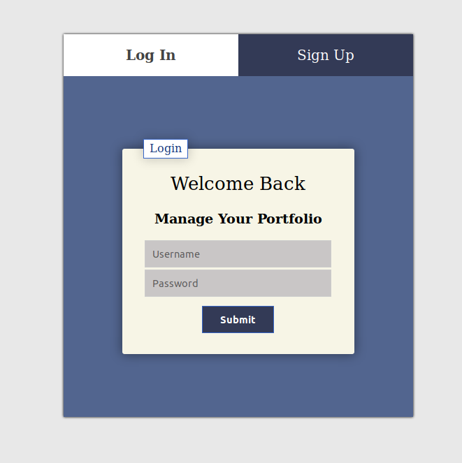
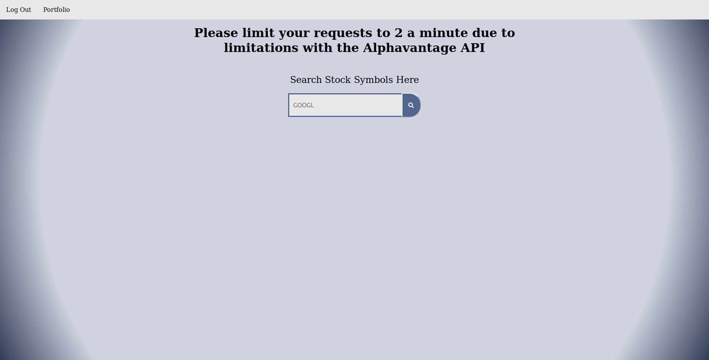
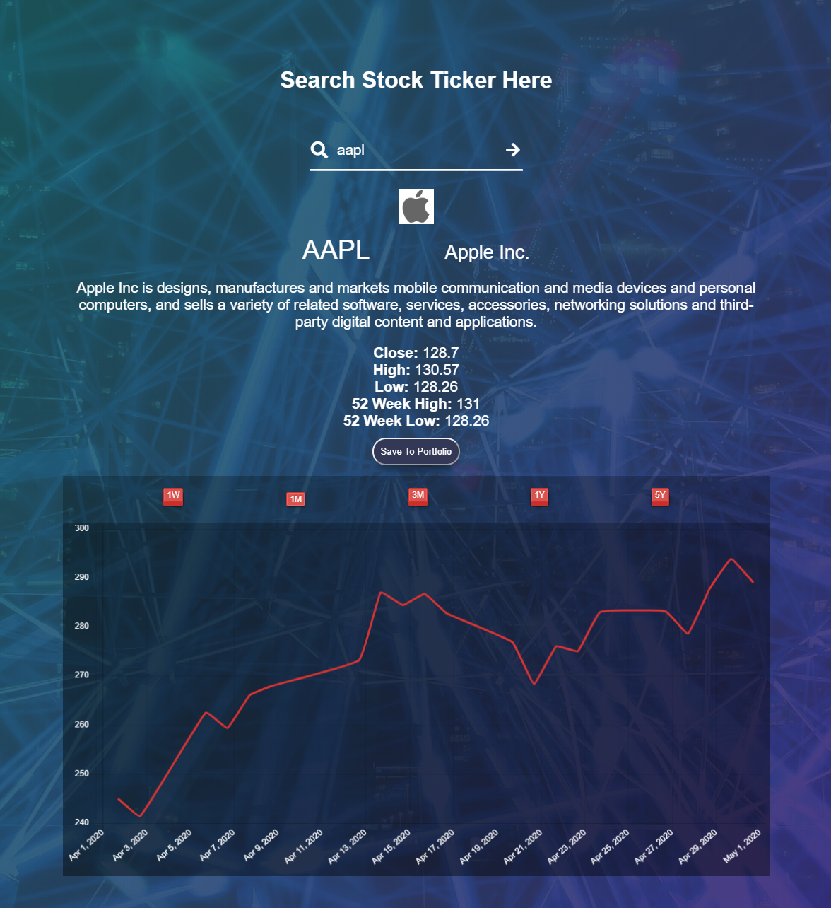
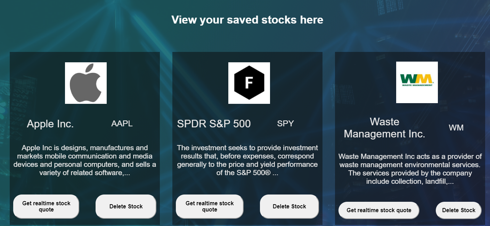
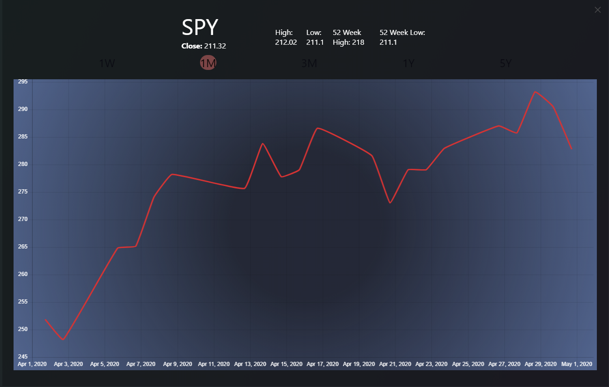

# Micro Manager

This app allows you to search and store stock information as well as get realtime/historical stock info 
with 5 years of trends shown using chart.js.

## Documentation
The landing page allows you to log in or create a new profile with a username and password. From there 
stocks can be searched by ticker symbols and a realtime stock quote and trend graph is rendered. From there
basic stock info can be saved to your portfolio with a button click if logged in. If not logged in, the user
will be redirected to the login screen. The porfolio page displays all stocks saved to your portfolio. From there
a user can either get a realtime quote, rendered in a lightbox, or delete saved stocks with the click of a button

## Live App 

- [Live App](https://micro-manager.herokuapp.com)

### Demo Login (no caps)

Username: demo

Passord: pass

## Screenshots
Signup/Login Page:

Stock Search Page:

My Portfolio Page:

## Created Using

* HTML
* CSS
* Javascript
* jQuery
* node.js
* Express
* Mongoose
* MongoDB

## Author

* **Brian O'Carroll** 
* **bocarroll36@gmail.com**
